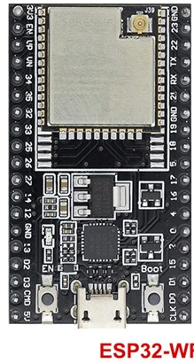
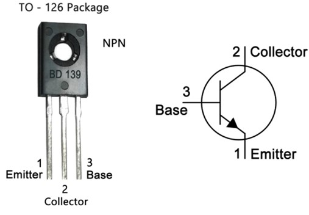
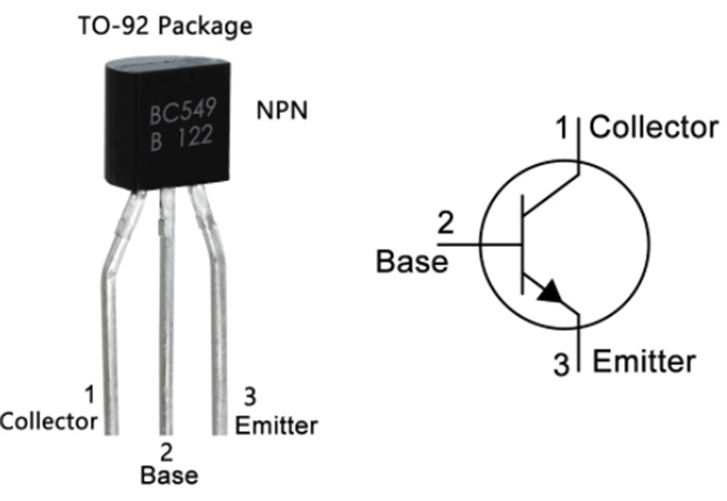
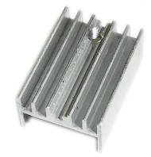
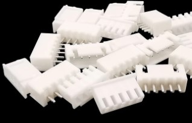
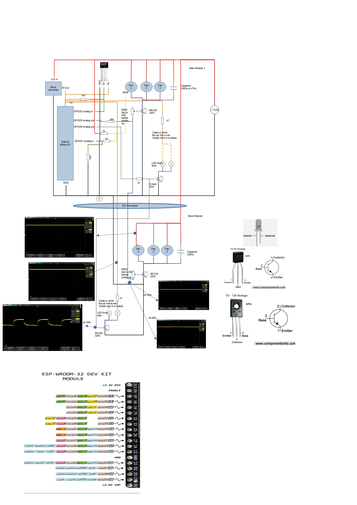

# Radiator fan controlled
The radiator fan is used to control the airflow of the radiators to be able to heat the house via low temperatures.

Pictures of the parts

## Description and operation instructions
The fans are turned on when a certain temperature of the radiator is detected and turned off when it is below another temperature value. The fans are controlled via different levels where at lower temperature levels the fan runs at a lower speed and when the temperature level is high the fan runs at a higher speed. The logic is running on the ESP32. To be able to override the logic there is an override variable which enables remote control and bypasing the ESP32 fan control. 
The fans are modular build where the first unit is the master which has 3 fans and the micro controller ESP32. It can be extended with a number of modules which act as slaves. Each module contains 3 fans. Tested with a maximum of 4 modules. 1 master and 3 slaves.

 ## Technical description
The ESP32 provides an analogue value which is fed into a transistor. The transistor amplifies the voltage and is typically operating between 5V and 12V. Lower than 5V will stop fans as they are not PWM fans. The ESP32 is running ESPHOME and connected to Home Assistant. The sensor for the temperature is included in the master module. Slaves will get the analogue value from the master and amplified it via the transistor. A trim potential meter is used to tune the master and slave modules as there are voltage losses when connecting multiple modules. By tuning the speed of all fans of all modules can be aligned. Best is to set the 500Ohm potential meter to 250Ohm before soldering it in. This provides space to tweak. When all modules are connected to the master, spin the fans and connect a scope with multiple channels if you have one and tune the voltages via the potential meters so they are almost the same in the upper and lower speeds of the fans. If you don't have a scope, then use preferrably multiple multimeters to measure the voltages and tune. It is also possible to use one multimeter, but you need to measure, tune and measure the other modules one by one.
The master with its slaves run independent of Home Assistant, but could be overwritten by an override variable.
The ESP32-wroom-32U was chosen as it has an external antenne which can be brought to the front of the radiator to receive a better wifi signal.
Calculation of the resistor to connect the BD139 to the ESP32
	ESP 32 delivers max 40mA per pin at 3,3V
	The DB139 has the following specs:
		Emitter - base 0,5A at a voltage of max 5V
	3,3V max / 20mA = 165 Ohm.
	Selected 150 Ohm as I have that in stock
Measuring the RPM via the ESP32 is okay till the voltage drops below 10V as the RPM signal then becomes too weak. When the RPM is measured then it also consumes power and the fan will earlier stop to spin then the other fans which are connected when the voltage is lowered.
The fan that I use is a more expensive one. It is quite, has a high airflow with low current and a high 100.000 hours estimated runtime. Comparing it to a € 1,5 fan, the cheap fan is way less quite, do have a higher airflow, which I doubt if it is needed and uses twice the amount of current. With the calculation that I made the more expensive fan will become equal after 2 years while the fan then for the remainder of its lifetime consumes less power.
Use a 1k resistor behind RPM. If not then the other fans keep spinning when off.
Power lines red and black are 24AWG, Rest is 28AWG. Cables to connect the modules are 24AWG as that is easier to connect the (Dupont) JST pins to.

The code can be found at the end of this page. Specifics like the modification of the temperature sensor address are described at the code block.

### Parts

Multiple colored silicon cables AWG 24 and 28

#### Master module
3 x Fan AABCOOLING Super Silent Fan 5

Fan pinout pinout
- 12V = Red
- GND = Black
- RPM = Yellow

1 x ESP32

Dallas DS18B20 temperature sensor

1 x BD139 NPN transistor

1 x BC549 NPN transistor (option for leds)

Heatsink TO220

1 x Mini360 DC- DC buck converter

PCB 4 x 6 Used to mount the ESP32

PCB 2 x 8 Used to connect the JST to and to mount the transistor(s)

Trim potentiometer R 500 

Resistors
- 1 x 47hm (option for leds)
- 1 x 150
- 2 x 1k
- 1 x 1k (option for leds)
- 1 x 4k7

- 1 x 1000u capacitor

2 x 5mm Warm White led (option)

Magnets
- 12 x 6 mm

- 8 x 4 mm

- 1 x screw M2x8mm

- 4 x screw M2x6mm

- 1 x 12V DC adapter

- 1 x 5 pin JST male - female connector

1 x 5.5 x 2.1 Female DC power plug

#### Slave module
3 x Fan AABCOOLING Super Silent Fan 5

1 x BD139 NPN transistor

1 x BC549 NPN transistor (option for leds)

Heatsink TO220

PCB 2 x 8 Used to connect the JST to and to mount the transistor(s)

Trim potentiometer R 500 Ohm W501

- 1 x 47hm Resistor (option for leds)

- 1 x 1000u capacitor

- 2 x 5mm Warm White led (option)

- 2 x 5 pin JST male - female connector

Magnets
- 12 x 6 mm

- 1 x screw M2x8mm

- 2 x screw M2x6mm

### Schematic overview

 
•	Power the circuit only via 12V and run code updates via OTA and ESPHOME.

### ESPHOME Configuration
### ESPHome Configuration in Home Assistant
Create a new ESPHOME device with this code:
### Code
[Code in ESPHOME](code radiator-huiskamer-voor.vbs)
Boot the ESP with the Dalles temperature sensor connected. This will show in the log at boot time the address of the connected Dallas sensor. Copy it and update the code with the retrieved address.

### 3D printer files
[Code in ESPHOME](code.vbs)