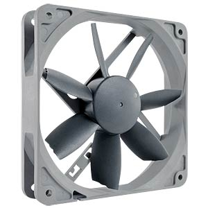

# Fan Shed and door contacts shed and gate
This ESP32 controls the door contacts of the shed and gate and the fan of the shed to reduce the humidity in the shed.

## Description and operation instructions
The fan is turned on when a certain humidity is detected and turned off when it is below another humidity value. Opening or closing the shed door has impact as with an open door it is not logical to run the fan. Hence opening the door will immediately shut down the fan. The fan is controlled via different levels where at lower humidity levels the fan runs at a lower speed and when the hunidity level is high the fan runs at a higher speed. The fan is also turned on when the temperature is very high. The logic is running on the ESP32. To be able to override the logic there is an override variable which enables remote control and bypasing the ESP32 fan control.

 ## Technical description
The PWM fan is controlled via the PWM signal coming from the ESP32. The ESP32 is running ESPHOME and connected to Home Assistant. The sensor for the humidity is included in this module, the sensors of the shed door and the gate door are connected to this ESP32, but they only report to Home Assistant where the door sensors can be used with logic in NodeRed.

### Parts
1 x NodeMCU

1 x DHT22 or AM2302

1 x DHT22 or AM2302 vs DHT11

2 x Reed contact

1 x Fan NO NF-S12B 1200P Noctua NF-S12B redux-1200 PWM, 120mm

Fan pinout pinout

1 x Mini360 DC- DC buck converter

Resistors
1 x 180
3 x 1k
1 x 4k7

1 x 12V DC adapter

### Schematic overview

 
•	Power the circuit only via 12V and run code updates via OTA and ESPHOME.

### ESPHOME Configuration
### ESPHome Configuration in Home Assistant
Create a new ESPHOME device with this code:
### Code
[Code in ESPHOME](code.vbs)